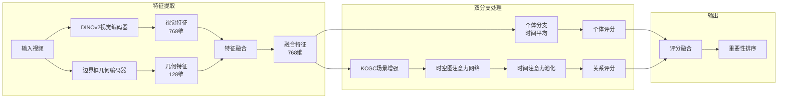
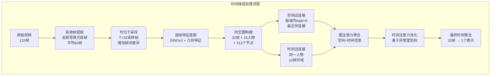
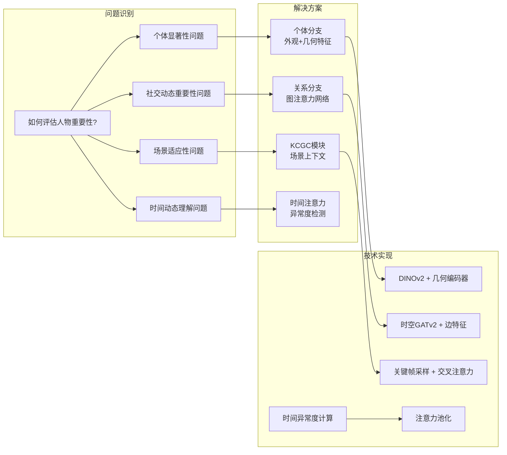
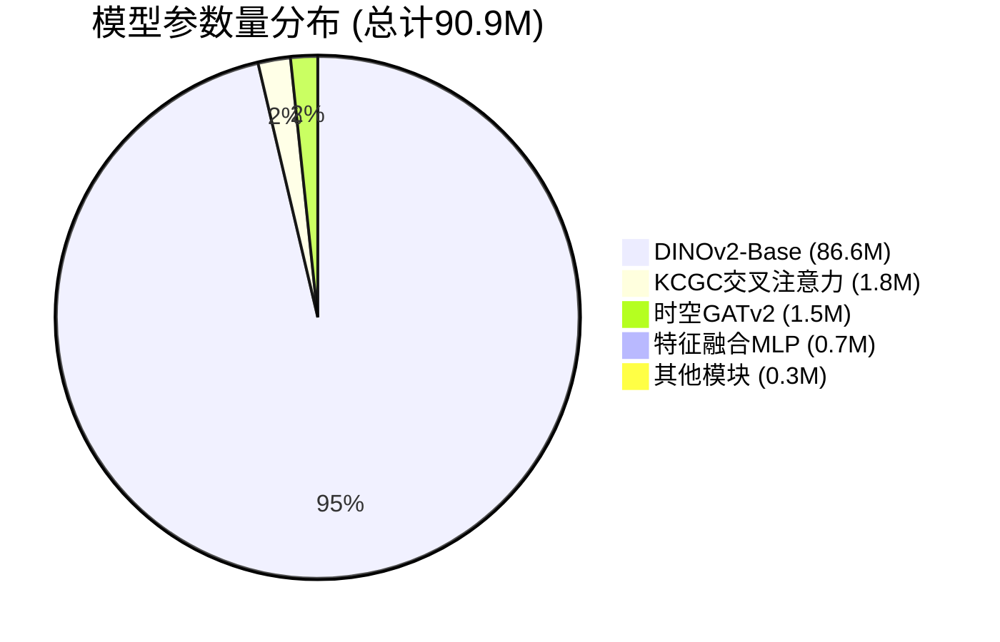
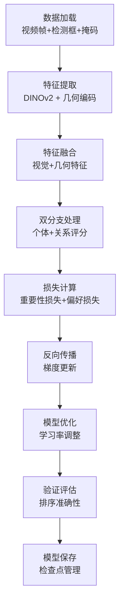

# 视频人物重要性排序模型 - 可视化架构图

## 整体架构流程图

```mermaid
graph TB
    subgraph "输入数据层"
        A[视频帧序列<br/>frames: B×T×3×H×W<br/>T=32采样帧] --> B[人物检测框<br/>bboxes: B×T×N×4<br/>N=16人物槽位]
        B --> C[人物掩码<br/>person_mask: B×T×N<br/>有效人物指示器]
    end

    subgraph "特征提取主干网络"
        D[ROI裁剪<br/>grid_sample → 196×196] --> E[DINOv2-Base<br/>86.6M参数<br/>ViT-B/14架构]
        E --> F[CLS Token提取<br/>768维特征向量]
        F --> G[L2归一化<br/>vis_feats: B×T×N×768]
        
        H[边界框几何特征<br/>9个静态特征<br/>x1,y1,x2,y2,cx,cy,w,h,area] --> I[几何编码器<br/>MLP: 9→128→128<br/>+ LayerNorm]
        I --> J[geom_feats: B×T×N×128]
    end

    subgraph "特征融合层"
        K[特征拼接<br/>cat(vis_feats, geom_feats)<br/>896维] --> L[融合MLP<br/>Linear(896→768)<br/>+ LayerNorm + ReLU + Dropout]
        L --> M[fused: B×T×N×768<br/>融合特征]
    end

    subgraph "个体分支 (静态显著性)"
        N[时间维度平均<br/>mean_T(fused)<br/>消除时间变化影响] --> O[个体评分网络<br/>LayerNorm → Linear(768→256)<br/>→ ReLU → Dropout → Linear(256→1)]
        O --> P[self_scores: B×N<br/>个体重要性得分]
    end

    subgraph "关系分支 (社交动态)"
        Q[KCGC场景上下文<br/>均匀采样K=T//4关键帧] --> R[DINOv2全帧编码<br/>无梯度，场景语义]
        R --> S[交叉注意力<br/>fused + scene_context<br/>→ fused_ctx: B×T×N×768]
        
        T[时空图构建<br/>节点: (person, frame)] --> U[空间边<br/>同帧topk=8最近邻<br/>特征: 位置距离+IoU]
        T --> V[时间边<br/>同人物±window=2<br/>特征: 外观差异向量]
        
        U --> W[图注意力网络<br/>2× GATv2Conv<br/>512维，4头注意力]
        V --> W
        S --> W
        
        W --> X[graph_feats: B×T×N×512<br/>图表示特征]
        
        Y[时间异常度计算<br/>temporal_dev = fused_t - mean_T(fused)<br/>衡量行为异常程度] --> Z[时间注意力池化<br/>attn = softmax(Linear([graph, temp_dev]))
        X --> Z
        Z --> AA[加权聚合<br/>rel_pooled = Σ_t(attn·graph_t)<br/>B×N×512]
        AA --> AB[关系评分网络<br/>LayerNorm → Linear(512→256)<br/>→ ReLU → Dropout → Linear(256→1)]
        AB --> AC[rel_scores: B×N<br/>关系重要性得分]
    end

    subgraph "输出融合层"
        AD[双分支融合<br/>logits = self_scores + rel_scores<br/>B×N] --> AE[温度调节<br/>scores = softmax(logits/τ)<br/>τ=1.0]
        AE --> AF[掩码处理<br/>⊙ valid_mask<br/>无效位置填充0]
        AF --> AG[最终输出<br/>importance_scores: B×N<br/>重要性排序结果]
    end

    %% 连接关系
    A --> D
    C --> D
    B --> H
    G --> K
    J --> K
    M --> N
    M --> Q
    M --> Y
    P --> AD
    AC --> AD
```

## 模块交互详细图



## 数据流时间维度图



## 创新点可视化

```mermaid
graph TB
    subgraph "核心创新架构"
        A[双分支分解] --> A1[个体分支<br/>静态外观+几何]
        A --> A2[关系分支<br/>社交动态]
        
        B[KCGC场景上下文] --> B1[关键帧采样<br/>K=T//4]
        B --> B2[场景语义编码<br/>DINOv2全帧CLS]
        B --> B3[交叉注意力注入<br/>场景感知]
        
        C[时空图结构] --> C1[联合节点<br/>(人物, 帧)]
        C --> C2[空间边<br/>位置关系]
        C --> C3[时间边<br/>外观变化]
        
        D[时间异常度注意力] --> D1[异常度计算<br/>dev = current - average]
        D --> D2[注意力加权<br/>关注异常时刻]
        D --> D3[关键事件发现<br/>无需动作标签]
    end
```

## 解决问题对应图



## 模块参数量分布图



## 训练流程图



这些可视化图表从不同角度展示了架构的设计思路、数据流向、创新点和解决问题的对应关系，帮助理解整个系统的设计哲学和实现细节。